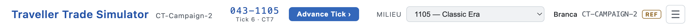
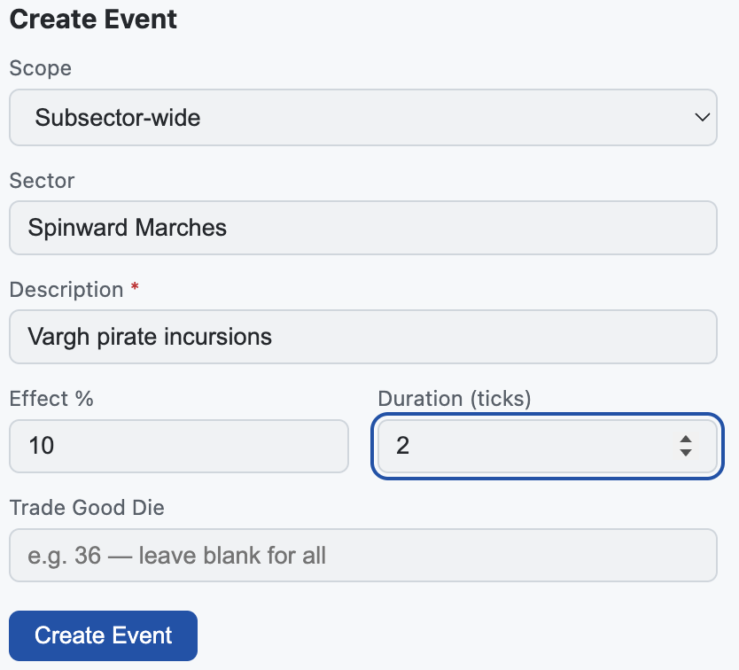

# GM Tutorial: Running a Session

**Prerequisites:** Campaign created and at least one ship assigned.
See [Campaign Setup](./gm-campaign-setup.md) if you have not done that yet.

**Related tutorials:**
- [Player: First Trade](./player-first-trade.md)
- [Player: Passengers, Fuel & Mail](./player-services.md)
- Reset PIN procedure references [Campaign Setup → Save the Recovery Code](./gm-campaign-setup.md#2-save-the-recovery-code)

---

## Typical Session Flow

Each session generally follows this rhythm:

1. Players select worlds, open Port → Market, and buy cargo or book passengers
2. Players purchase fuel at Port → Services if the tank is low
3. Players accept mail contracts at Port → Services for additional income
4. Players use the Jump tab to pick a profitable destination
5. You advance the tick (**Advance Tick ›** in the header or press `T`)
6. Prices shift; random events may fire on next world visits
7. Players navigate to the destination — passengers and mail auto-deliver on arrival
8. Players sell their cargo at the destination
9. Repeat from step 1

You can create market events manually at any time to add narrative flavor. Random events
also fire automatically on a world's first Market tab visit each tick.

---

## 1. Advance the Tick

Click **Advance Tick ›** in the header, or press `T`. One tick = one jump-week = 7 Imperial days.

What happens automatically on tick advance:

- Prices are recalculated for all worlds using CT7/T5 trade rules
- Market events that have reached their expiry tick are closed automatically
- A random event may fire on the next world visit (one per world per tick, M.U.L.E.-style)
- Monthly OHLC candlestick rollup triggers every 4 ticks
- Annual rollup and event compaction triggers every 48 ticks

> ℹ️ **Note:** Only the Referee can advance the tick. All players see the current
> date in the header but cannot advance it.

---

## 2. Create Market Events

Open the Referee panel → **Events** tab → **New Event**.

| Field            | Notes                                                                                |
| ---------------- | ------------------------------------------------------------------------------------ |
| Scope            | *Local* — affects one world. *Subsector* — affects all worlds in the subsector.      |
| World            | Which world (for Local scope)                                                        |
| Trade Good       | Specific good affected, or *All Goods*                                               |
| Buy modifier %   | Adjusts the *purchase* price — positive makes buying more expensive, negative cheaper. Leave blank for no effect on buying. |
| Sell modifier %  | Adjusts the *sale* price — positive means players receive more when selling, negative means less. Leave blank for no effect on selling. |
| Severity         | Minor / Major / Crisis — controls the badge color and icon on the Market tab         |
| Duration (ticks) | How many ticks the event lasts. Closes automatically at that tick.                   |
| Description      | Narrative text shown in the Market tab banner and Events history                     |

Events fire automatically at random on a world's first Market tab visit each tick. Manual
events stack on top of the automatic ones.

---

## 3. Use the Events Catalogue

The Events tab includes a **Catalogue** — 20 pre-built M.U.L.E.-style events covering
common scenarios (shortages, surpluses, piracy, industrial accidents, and more).

Click any catalogue entry to pre-fill the New Event form. Review and adjust the fields
(especially **Scope** and which **World**), then click **Create Event**.

The catalogue is a time-saving shortcut. You can still create events entirely from scratch.

---

## 4. Expire Events Early

In the Referee panel → Events tab, each active event has an **Expire** button. Click it
to end the event immediately, regardless of its original duration.

Expired events remain visible in the world's **Events** tab (dimmed) so players can see
the historical price context. Use early expiry when a narrative situation resolves ahead
of schedule.

---

## 5. Manage Passengers

When players book passengers via Port → Passengers, the manifest appears in the Referee
panel → **Ships** tab → expand ship → passenger section.

**Auto-delivery:** Passengers are automatically delivered when you move the ship to their
destination via the ship edit form. Players can also trigger delivery themselves using
Jump → Select.

**Issuing a refund:** Click **Refund** on a manifest row to cancel a passenger booking.
This reverses the fare from the ship's credit account and marks the passenger as refunded.

> ⚠️ **Warning:** Refunds cannot be undone. The fare is immediately debited from the
> ship's current balance.

---

## 6. Track Fuel

Each ship has a **Fuel Capacity** (tank size) and **Current Fuel** (current level). Both
are visible in the ship stat grid and editable in the ship edit form.

Fuel is **not consumed automatically** — you must manually reduce *Current Fuel* in the
ship edit form after each jump. The formula for jump fuel is:

> **Fuel = hull tons × 10% × parsecs**  
> Example: J-2 jump in a 200-ton ship = 40 tons of fuel

Players purchase fuel at starports via Port → Services. The purchase automatically
increments *Current Fuel* (and prevents over-filling).

---

## 7. Manage Players

The Referee panel → **Players** tab lists every character with their current ship
assignment and skill list.

Skills are free-form text — any name is valid. Trade-relevant skills include:
**Broker, Trader, Liaison, Admin, Steward, Streetwise**. Skills are reference data
in the current version; they do not automatically modify prices.

To add a skill: click the character's row, then type the skill name and level.
Remove a skill with the × button on the skill chip.

---

## 8. Edit the Campaign Label

The campaign display name can be changed at any time. Open the Referee panel →
**Campaign** tab, click the **✎** button next to the campaign name, type the new label,
and press **Save**.

Only the label changes — the campaign code, trade rules, and milieu cannot be modified
after creation.

---

## 9. Reset a Player's PIN

If a player forgets their PIN:

1. Go to the login screen → **Reset PIN** tab
2. Enter the **Campaign Code**, the player's **Character Name**, and the campaign's
   **Recovery Code** (saved at campaign creation — see
   [Campaign Setup → Save the Recovery Code](./gm-campaign-setup.md#2-save-the-recovery-code))
3. Enter and confirm a new PIN for that character
4. Click **Reset PIN**

The player can then sign in with the new PIN. Character names are case-sensitive.

> ℹ **Note:** To generate a new recovery code: Referee panel → Campaign tab →
> **Generate New Recovery Code**. This immediately invalidates any previous code.

---

## 10. Delete a Campaign

The **Danger Zone** section at the bottom of the Referee panel → Campaign tab lets you
permanently delete the campaign. This removes all associated data — ships, cargo, market
history, players, events, and trade records — and **cannot be undone**.

Click **Delete Campaign…** to reveal the confirmation form, enter your Referee PIN, and
click **Confirm Delete**. You will be signed out and returned to the login screen.

---

*Back: [Campaign Setup](./gm-campaign-setup.md) · Next: [Player: Getting Started](./player-getting-started.md)*
