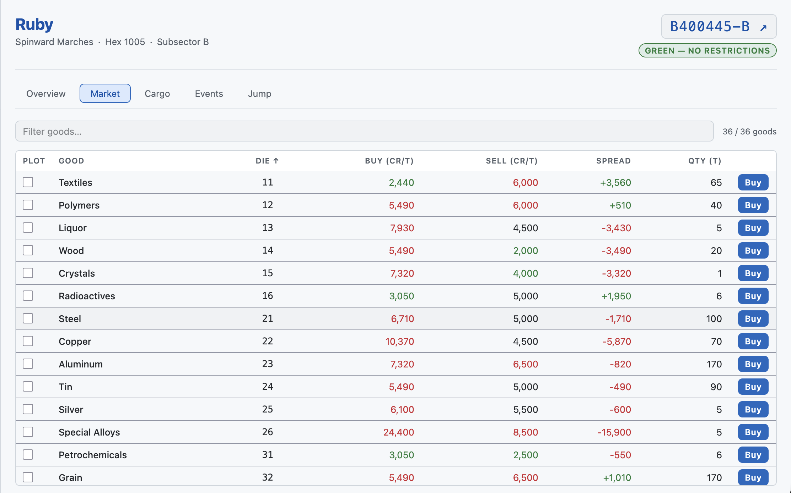
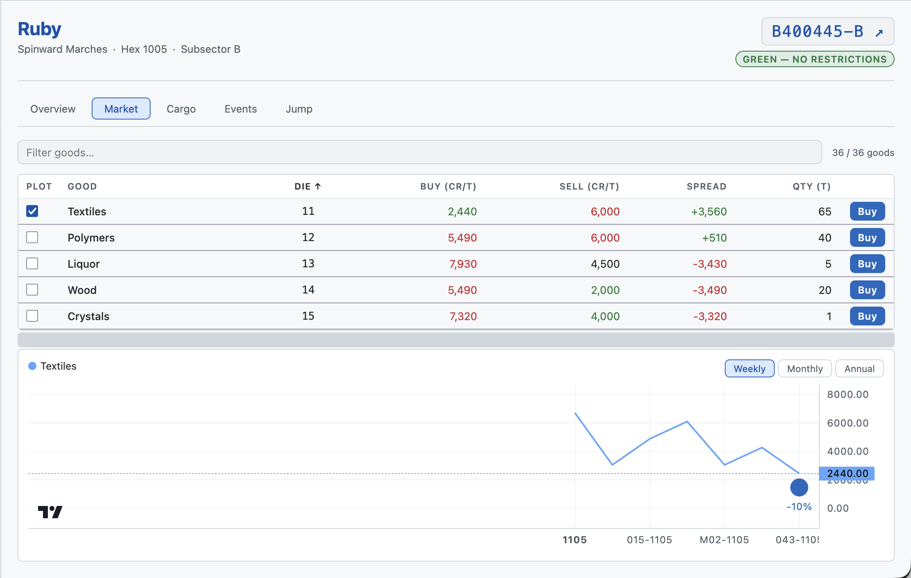
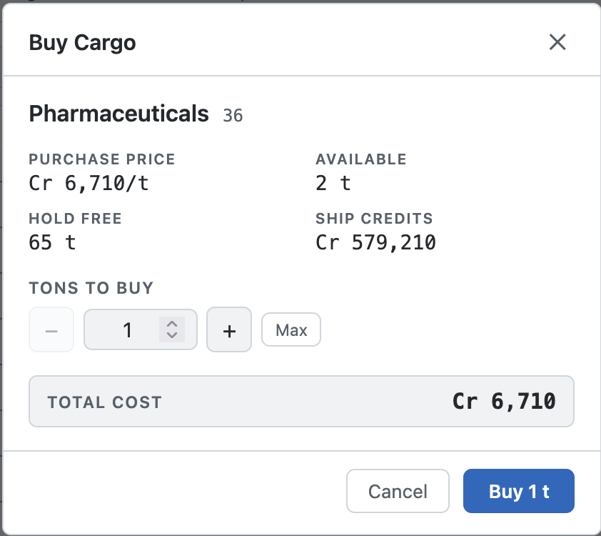
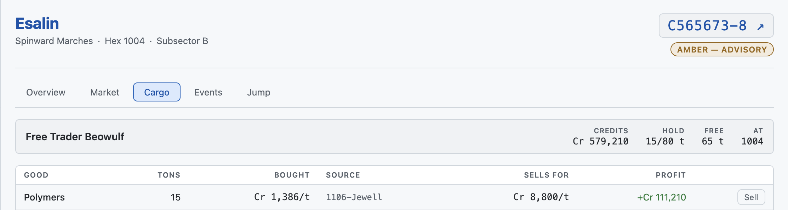
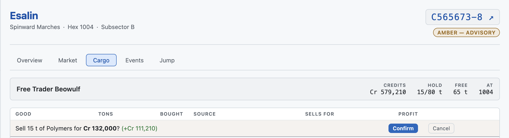

# Player Tutorial: Your First Trade

**Prerequisites:** You have joined a campaign and have a ship assigned.
See [Getting Started](./player-getting-started.md) if you have not done that yet.

**Related tutorials:**
- Selecting a world: [Getting Started → Navigate the Interface](./player-getting-started.md#2-navigate-the-interface)
- Finding profitable routes: [Route Analysis](./player-route-analysis.md)

---

## Overview

A complete trade has four steps: **select a world → buy → jump → sell**. The goal is to buy goods where they are cheap and sell them where prices are high.

Prerequisites:

- A ship with available hold space —
  see [Getting Started → Find Your Ship](./player-getting-started.md#4-find-your-ship)
- *Can Trade* authorization — if the Buy button is missing, ask your Referee to check your crew record
- A world selected in the left sidebar

---

## 1. Read the Market

Select a world in the left sidebar (see [Getting Started → Navigate the Interface](./player-getting-started.md#2-navigate-the-interface)) and open the **Market** tab (`M`).

| Column      | What it means                                                                   |
| ----------- | ------------------------------------------------------------------------------- |
| Plot        | Check to add this good's price history to the chart below the table             |
| Good        | Trade good name                                                                 |
| Die         | The d66 result that identifies this good (used in CT7/T5 rules)                 |
| Buy (Cr/t)  | Price per ton to purchase here *this week*                                      |
| Sell (Cr/t) | Price per ton if you sell here this week                                        |
| Spread      | Sell minus Buy per ton. Positive = you could buy and sell here without jumping. |
| Qty (t)     | Tons available this week. Resets each tick — stock does not carry over.         |

**Color coding:** Green = below base price (buyer's market). Red = above base (seller's market). Look for goods that are green here and red at your intended destination — the price gap is your profit margin.

Goods with an amber left border are affected by an active market event. A banner above the table explains the event.

---

## 2. Buy Cargo

Find a trade good with available quantity (Qty > 0) and click **Buy** on its row.
A purchase dialog opens:

- Purchase price per ton
- Available quantity and your free hold space
- Your current credits

Enter the tons you want to buy, or click **Max** to fill the hold with as much as you can afford and store. Click **Confirm**.

Credits are debited immediately. The new cargo row appears in the **Cargo** tab with the purchase price and source world recorded.

ℹ️ **Note:** The Buy button only appears when you have a ship, *Can Trade* authorization, and the good has stock this tick. If it is missing, ask your Referee.

---

## 3. Find a Destination

Switch to the **Jump** tab (`J`). This lists all worlds reachable from your current location within your ship's jump rating.

With cargo in the hold, a **Profit** column appears showing how much you would make selling your entire hold at each destination. The list sorts by profit automatically — the best destination is at the top.

For a full breakdown of reading and using this tab, see [Route Analysis](./player-route-analysis.md).

---

## 4. Complete the Jump
In the **Jump** tab, click **Select** on your chosen destination. This:

1. Records the destination as your ship's current world
2. Navigates to that world in the sidebar
3. Switches to the Market tab for the new world automatically

Alternatively, navigate to the destination world manually in the sidebar, then click **Set Here** in the Cargo tab status bar to update your ship's recorded location without going through the Jump tab.

ℹ️ **Note:** Ticks are advanced by the Referee separately from player jumps. Check with your Referee about in-game time coordination.

---

## 5. Sell at the Destination

At the destination world, open the **Cargo** tab (`C`). Each row in your hold shows:

- The sell price per ton at the current world
- Projected profit or loss vs. what you paid (green = profit, red = loss)

Click **Sell** on a row to open the confirmation. 

Review the total payout and net profit, then click **Confirm**. Credits are added to the ship's account and a trade record is logged automatically.

A brief flash in the bottom-right corner confirms the profit or loss. Repeat for each cargo row you want to sell.

---

*Previous: [Getting Started](./player-getting-started.md) · Next: [Route Analysis](./player-route-analysis.md)*
