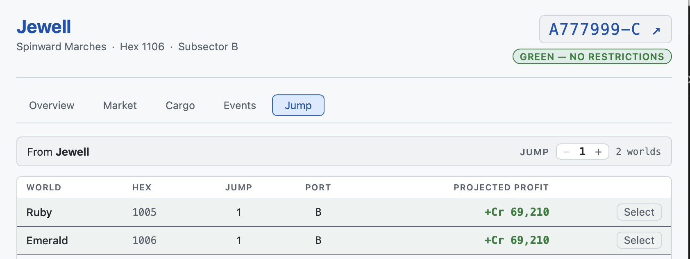
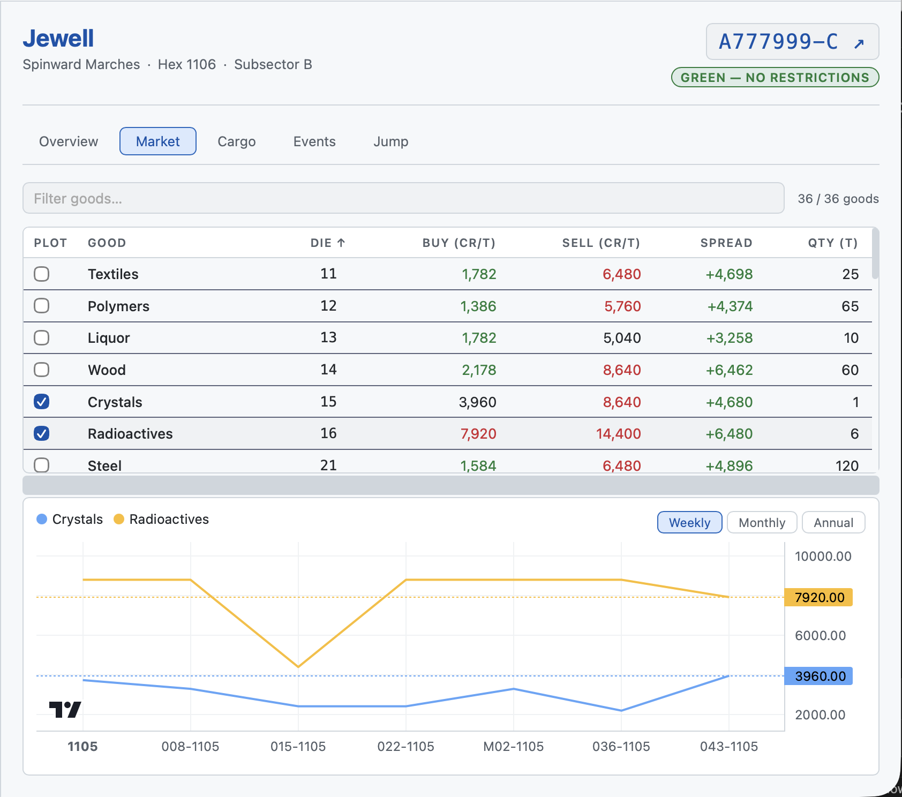

# Player Tutorial: Route Analysis

Use this tutorial to understand how to use the Jump tab to plan profitable trade routes before and after buying cargo.

**Related tutorials:**
- [Your First Trade → Find a Destination](./player-first-trade.md#3-find-a-destination)
- [Your First Trade → Sell at the Destination](./player-first-trade.md#5-sell-at-the-destination)

---

## When to Use Route Analysis

The Jump tab gives you two different views depending on whether your hold has cargo:

- **Before buying:** Browse reachable worlds; check starport classes; open the Market tab at destination candidates to compare sell prices with your current world's buy prices.
- **After buying:** The Profit column shows the actual projected earnings from selling your current hold at each destination. The list sorts by profit — best option at the top.

To begin, select the world you are **departing from** in the left sidebar, then open the **Jump** tab (`J`). The route list is always relative to the selected world.

---

## 1. Reading the Route Table

Each row represents a reachable destination:

| Column | What it means                                                                                                                          |
| ------ | -------------------------------------------------------------------------------------------------------------------------------------- |
| World  | Destination world name                                                                                                                 |
| Hex    | Hex coordinate in the sector grid                                                                                                      |
| Jump   | Parsecs required. Must be ≤ your ship's jump rating for a direct jump.                                                                 |
| Port   | Starport class (A–X). A and B ports offer larger quantities and generally better prices.                                               |
| Profit | Net projected profit from selling your entire current hold at this world. Green = profit, red = loss. Only shown when cargo is loaded. |

**Sort order:** cargo loaded → sorted by profit (highest first). Empty hold → sorted by jump distance then name.

---

## 2. Use the Price Chart

Before committing to buy a good, check its price trend in the **Market** tab chart. Check the **Plot** checkbox on any row to add it to the chart below the table.

Three time frames are available when a single good is plotted:

| Frame   | Resolution                   | Best for                                 |
| ------- | ---------------------------- | ---------------------------------------- |
| Weekly  | One data point per tick      | Spotting recent trends and event effects |
| Monthly | One candlestick per 4 ticks  | Identifying cyclical patterns            |
| Annual  | One candlestick per 48 ticks | Long-term price history                  |

Plot multiple goods simultaneously to compare them. Drag the divider between the table and chart to resize both panels.

Event markers appear on the weekly chart: blue circle = Minor, amber square = Major, red arrow = Crisis.

---

## 3. Adjust Jump Range

The **−** / **+** stepper at the bottom of the Jump tab temporarily overrides your ship's rated jump range for planning. This does **not** change the ship's actual rating or commit anything.

Use a higher range to scout multi-hop routes — worlds your ship cannot reach in a single jump but that might be worth a layover at an intermediate world. Use a lower range to focus on the nearest options.

ℹ️ **Note:** Clicking Select does not enforce the range check — the simulator trusts you to play within your ship's actual capabilities. Your Referee is the arbiter of what is possible in-game.

---

## 4. Commit the Jump

Click **Select** on your chosen destination row. The sim will:

1. Update your ship's location to the destination world
2. Select that world in the sidebar
3. Switch to the Market tab for the new world

You can now sell your cargo. See
[Your First Trade → Sell at the Destination](./player-first-trade.md#5-sell-at-the-destination).

If you navigated to the destination manually via the sidebar instead, use the **Set Here** button in the Cargo tab status bar to update your ship's recorded location without going through the Jump tab.

---

*Previous: [Your First Trade](./player-first-trade.md) · Back to [Tutorial Index](./index.md)*
